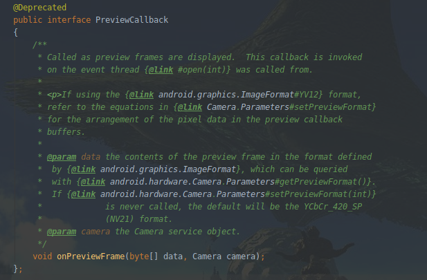
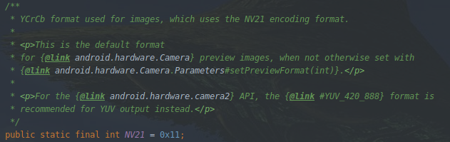

## Android Camera2中如何获取预览YUV数据

Camera1中我们可以通过onPreviewFrame接口直接获取到默认为NV21格式的预览数据，
如注释所示，还可以通过调用setPreviewFormat方法要求Camera返回YV12格式的预览数据



那么在Camera2的架构中，我们要如何获取NV21或者YV12格式的预览数据呢？

在之前的文章(Android Camera2详解)中描述到，要获取每一帧的预览数据，  
我们需要ImageReader这个类的帮助．

```
val imageReader = ImageReader(width, height, format, maxImages)
```
可以看到有一个format的参数可以指定，遗憾的是NV21格式是不支持的，  
进入ImageReader的构造方法中可以看到：
```
 if (format == ImageFormat.NV21) {
     throw new IllegalArgumentException( "NV21 format is not supported");
 }
```

### NV21
查看文档关于NV21的描述，发现在Camera2中官方建议使用YUV_420_888



YUV_420_888是一种YUV的采样格式，Y:U:V是4:1:1，也就是说其中每一个UV被四个Y共享，
888表示每一个分量都是８bits

NV21和YV12都是这种YUV_420的采样格式，只是其中U,V分量的排列不一样．

NV21:先排Y, 再VU交替排列, 码流：YYYY YYYY VU VU

YV12:先排Y, 再排V, 最后排列U, 码流：YYYY YYYY VV UU

PS:
1. YUV的采样格式有很多种，同一种采样格式还存在不同的排列方式，导致YUV的格式五花八门的，
比如：NV21, NV12, YV12, YU12, YUY2...  
关于这方面的内容推荐阅读头条大佬的文章一文读懂YUV的采样与格式, 图文并茂，通俗易懂
2. 虽然YUV存在444, 422, 420这些采样格式，但是深入ImageReader源码后，
发现只能使用YUV_420_888, 另外两种会抛出UnsupportedOperationException异常

在ImageReader的实例中，参数format设置为YUV_420_888，注册
ImageReader.OnImageAvailableListener回调后，对于每一帧预览，我们拿到的是一个包装对象Image,
那么如何获取具体的byte[]数据呢？

在YUV_420_888这种格式下拿到的Image对象，存在以下几点规则：
1. Y, U, V的数据是分别存储在３个平面的;
2. plane#0为Y分量，plane#1为U分量，plane#2为V分量;
3. Y-plane的pixelStride一定为1, 而U-plane和V-plane的pixelStride则不固定.  
(所谓pixelStride是指连续的码流中有效位的偏移, 1表示数据是紧凑的, 连续有效, 中间不存在无效数据)
4. 每一个plane都有一个rowStride, 表示一行数据的长度, rowStride >= imageWidth, 这就是有些图片存在绿边的原因;
5. U-plane的rowStride一定等于V-plane的rowStride

知道了相关的规则,就可以开始撸代码了(笑: CommonUtil#readYuvDataToBuffer

### YV12
ImageReader的format是可以直接指定为YV12的, 这种格式下又是如何从Image对象中提取YUV byte[]呢?

通过阅读源码我们得知, 其实在应用层设置YV12或者YUV_420_888, 最后被映射到framework层的都是同一个东西.  
所以我们还是要通过3个平面来分别获取Y, U, V分量的数据.  
只不过从目前我测试的设备上来看, 3个分量的pixelStride总是为1,
不过官方文档并没有指定这一点, 说明实际情况还是要具体平台具体对待的.


